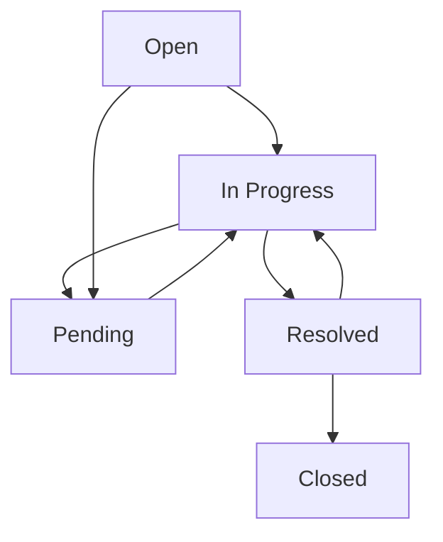

# 티켓 추적 및 상태 관리

Freshservice의 티켓 상태 시스템을 이해하고 효과적으로 추적하는 방법을 학습합니다. 각 상태별 의미와 처리 방식, 알림 설정을 통한 원활한 커뮤니케이션 방법을 안내합니다.

:::info 티켓 상태 관리 핵심 원칙
- 상태 변경은 실제 작업 진행에 따라 정확히 반영 필요
- 사용자 알림 설정으로 실시간 진행 상황 파악 권장
- Pending 상태 시 대기 사유와 예상 해결 시간 명시 필수
- 해결 완료 후 사용자 확인 절차를 통한 품질 보증 중요
:::

## 티켓 상태별 의미와 처리 방식

### 기본 상태 시스템

Freshservice의 티켓은 생성부터 완료까지 명확한 상태 체계를 따릅니다.

#### Open (열림)
- **의미**: 새로 생성되어 처리 대기 중인 상태
- **담당자 액션**: 티켓 검토 후 작업 시작 또는 재할당
- **사용자 역할**: 추가 정보 제공 대기
- **예상 시간**: 우선순위에 따라 15분~24시간

#### In Progress (진행 중)
- **의미**: 담당자가 적극적으로 문제 해결 작업 중
- **담당자 액션**: 문제 분석, 해결책 적용, 테스트 진행
- **사용자 역할**: 필요시 협조, 테스트 참여
- **진행 상황**: 정기적 업데이트 제공

#### Pending (대기)
- **의미**: 외부 요인으로 인한 일시적 작업 중단
- **대기 사유**: 
  - 사용자 응답 대기
  - 외부 업체 지원 대기
  - 부품 또는 소프트웨어 도착 대기
  - 승인 프로세스 진행 중

:::warning Pending 상태 주의사항
48시간 이상 Pending 상태가 지속되면 자동으로 사용자에게 알림이 발송됩니다. 장기간 대기가 예상되는 경우 사전에 안내하세요.
:::

#### Resolved (해결)
- **의미**: 문제 해결 완료, 사용자 확인 대기
- **담당자 액션**: 해결 방법 및 결과 상세 기록
- **사용자 역할**: 해결 상태 검증 및 피드백 제공
- **자동 처리**: 72시간 후 미응답 시 자동 Closed 전환

#### Closed (완료)
- **의미**: 모든 처리 완료, 사용자 만족 확인
- **최종 상태**: 더 이상 변경 불가
- **기록 보존**: 향후 유사 문제 해결 시 참조 자료 활용

### 상태 전환 규칙



## 티켓 추적 및 업데이트 확인 방법

### 웹 포털에서 티켓 추적

1. **내 티켓 목록 접근**
   - 대시보드에서 'My Tickets' 클릭
   - 상태별, 날짜별 필터링 가능

2. **개별 티켓 상세 보기**
   - 티켓 번호 클릭으로 상세 화면 접근
   - 진행 이력, 첨부파일, 커뮤니케이션 내역 확인

3. **실시간 업데이트 확인**
   - 새로운 댓글이나 상태 변경 시 즉시 표시
   - 담당자 메모와 내부 커뮤니케이션 구분

### 고급 검색 및 필터링

**검색 조건 활용:**
- 키워드: 제목, 설명, 댓글 내용 검색
- 상태: 특정 상태의 티켓만 필터링
- 날짜 범위: 생성일, 마지막 업데이트일 기준
- 담당자: 특정 담당자가 처리하는 티켓

**정렬 옵션:**
- 우선순위 순: 긴급한 티켓 우선 표시
- 업데이트 순: 최근 활동 티켓 먼저
- 생성일 순: 오래된 티켓부터 확인

:::tip 효율적인 티켓 관리 팁
즐겨찾기 필터를 설정하여 자주 확인하는 조건(진행 중인 티켓, 내가 생성한 티켓 등)을 빠르게 접근할 수 있습니다.
:::

## 알림 설정 및 커뮤니케이션 가이드

### 알림 설정 최적화

#### 이메일 알림 설정

**즉시 알림 권장:**
- 티켓 상태 변경
- 새로운 댓글 추가
- 담당자 변경
- 우선순위 변경

**일일 요약 권장:**
- 전체 티켓 현황
- 해결 완료 티켓 목록
- 대기 중인 티켓 알림

#### 모바일 푸시 알림

**긴급 상황 전용:**
- Critical 우선순위 티켓
- 보안 관련 알림
- 시스템 전체 장애 공지

### 효과적인 커뮤니케이션 전략

#### 상태별 커뮤니케이션 가이드

**Open → In Progress 전환 시:**
```
안녕하세요, [사용자명]님.

접수해주신 "[티켓 제목]" 건에 대해 검토를 완료하고 
해결 작업을 시작했습니다.

예상 해결 시간: [구체적 시간]
작업 내용: [간략한 작업 계획]

진행 중 추가 정보가 필요한 경우 연락드리겠습니다.

감사합니다.
담당자: [이름]
```

**Pending 상태 안내:**
```
작업 진행 중 외부 요인으로 인한 일시적 대기가 필요합니다.

대기 사유: [구체적 사유]
예상 재개 시점: [날짜 및 시간]
대기 중 준비사항: [사용자 액션이 필요한 경우]

궁금한 점이 있으시면 언제든 문의해주세요.
```

### 사용자 응답 및 피드백 활용

#### 효과적인 응답 방법

1. **질문에 대한 명확한 답변**
   - 담당자 질문을 정확히 이해하고 구체적으로 답변
   - 모르는 부분은 솔직히 표현하고 확인 후 답변

2. **추가 정보 제공**
   - 문제 재현 시 새로운 발견사항
   - 관련된 다른 시스템이나 업무 영향
   - 임시 해결책이나 우회 방법 발견

3. **해결 검증 참여**
   - 담당자가 제시한 해결책 테스트
   - 정상 작동 여부 상세 피드백
   - 예상과 다른 결과 발생 시 즉시 보고

:::success 원활한 소통의 결과
명확한 커뮤니케이션을 통해 문제 해결 시간이 평균 30% 단축되고, 재오픈율이 현저히 감소합니다.
:::

## 실무 활용 예시

### 상황 1: 글로벌 기업 24시간 운영팀
**목표**: 시간대가 다른 팀 간 원활한 티켓 인수인계
**방법**:
1. 상태별 상세한 작업 로그 기록
2. 다음 담당자를 위한 명확한 인수인계 메모
3. 지역별 알림 시간 설정으로 업무 시간 고려
4. 에스컬레이션 규칙으로 지연 방지

**결과**: 24시간 연속 서비스 품질 유지, 고객 만족도 95% 달성

### 상황 2: 중소기업 원격 근무 지원
**목표**: 재택근무 환경에서 효율적인 IT 지원 제공
**방법**:
1. 모바일 앱을 통한 실시간 상태 확인
2. 화상회의 도구와 연동한 원격 지원
3. 자동 알림으로 놓치는 업데이트 최소화
4. 셀프 서비스 옵션으로 간단한 문제 즉시 해결

**결과**: 원격 지원 효율성 200% 향상, 직원 만족도 대폭 개선

## 자주 발생하는 상태 관리 문제

### 상태 추적 관련 문제

#### 문제: 알림을 받지 못함
**원인**: 스팸 필터 또는 알림 설정 오류
**해결**:
1. 프로필 설정에서 알림 옵션 재확인
2. 이메일 주소 정확성 검증
3. 스팸함 확인 및 화이트리스트 추가
4. 관리자에게 시스템 알림 설정 문의

#### 문제: 상태가 오랫동안 변경되지 않음
**원인**: 담당자 부재 또는 우선순위 설정 오류
**해결**:
1. 티켓에 상태 문의 댓글 추가
2. 관리자에게 에스컬레이션 요청
3. 우선순위 재평가 및 조정 요청
4. 대체 담당자 배정 요청

#### 문제: 해결된 문제가 재발함
**원인**: 근본 원인 미해결 또는 임시 조치
**해결**:
1. 기존 티켓을 참조하여 새 티켓 생성
2. 근본 원인 분석을 위한 Problem 티켓 요청
3. 해결 과정과 재발 상황 상세 기록
4. 예방 조치 및 모니터링 방안 논의

:::tip 상태 관리 마스터 팁
티켓 생명주기를 이해하고 각 단계에서 적극적으로 참여하면 더 빠르고 정확한 문제 해결이 가능합니다.
:::