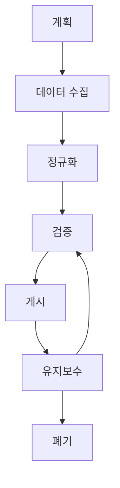

# Configuration Management Database (CMDB) 소개

## 📋 개요

CMDB(Configuration Management Database)는 네트워크 내 모든 하드웨어 및 소프트웨어 설치에 대한 정보를 볼 수 있는 중앙 위치입니다. 각 자산은 **Configuration Item (CI)**로 알려져 있습니다.

## 💡 CMDB 구축 모범사례

### 데이터 수집 전략
```markdown
📊 자동 데이터 수집:
✅ Discovery Agent - 개별 PC/서버에 설치
✅ Discovery Probe - 네트워크 스캔 기반
✅ API 연동 - 기존 시스템과 자동 동기화
✅ 에이전트리스 검색 - SNMP, WMI 활용

📋 수동 데이터 입력:
✅ CSV 대량 import - 기존 자산 대장 활용
✅ 모바일 앱 - 바코드 스캔으로 현장 등록
✅ 웹 폼 - 신규 자산 상세 정보 입력
```

### CI 유형별 관리 전략

#### 🖥️ 하드웨어 CI
```markdown
필수 속성:
- 제조사, 모델명, 시리얼 번호
- 구매일, 보증 기간, 위치
- 사용자, 담당부서
- 상태 (운영중, 예약, 폐기 등)

관계 설정:
- 사용자 ↔ 컴퓨터 (Uses)
- 컴퓨터 ↔ 소프트웨어 (Runs)
- 서버 ↔ 서비스 (Hosts)
```

#### 💿 소프트웨어 CI
```markdown
필수 속성:
- 제품명, 버전, 라이선스 유형
- 설치 날짜, 라이선스 만료일
- 라이선스 수량, 사용 중인 수량

관계 설정:
- 소프트웨어 ↔ 컴퓨터 (Installed on)
- 라이선스 ↔ 사용자 (Assigned to)
- 애플리케이션 ↔ 데이터베이스 (Depends on)
```

#### 🌐 서비스 CI
```markdown
필수 속성:
- 서비스명, 설명, 비즈니스 중요도
- 서비스 레벨, 가용시간
- 서비스 오너, 기술 담당자

관계 설정:
- 서비스 ↔ 애플리케이션 (Depends on)
- 서비스 ↔ 인프라 (Runs on)
- 서비스 ↔ 사용자 (Used by)
```

## ⚠️ CMDB 관리 주의사항

:::warning 데이터 품질 관리
- **정확성**: 자동 검색과 수동 검증을 병행하여 데이터 정확도 확보
- **완전성**: 모든 CI가 누락 없이 등록되었는지 정기적 확인
- **일관성**: 명명 규칙과 분류 기준을 일관되게 적용
- **실시간성**: 변경사항이 즉시 반영되도록 프로세스 구축
:::

### 데이터 품질 개선 방법
```markdown
자동화 도구 활용:
✅ 중복 CI 자동 탐지 및 병합
✅ 데이터 유효성 검사 규칙 설정
✅ 정기적 데이터 정합성 체크
✅ 사용하지 않는 CI 자동 식별

프로세스 개선:
✅ CI 등록/변경 승인 프로세스
✅ 정기적 데이터 검토 회의
✅ 담당자별 데이터 관리 책임 할당
✅ 사용자 교육 및 가이드라인 제공
```

## 📊 CMDB 성과 지표

| KPI | 목표 수치 | 측정 방법 |
|-----|-----------|-----------|
| **데이터 정확도** | > 95% | 샘플 검증을 통한 정확도 측정 |
| **CI 커버리지** | > 90% | 실제 자산 대비 CMDB 등록율 |
| **관계 정의율** | > 80% | CI 간 관계가 정의된 비율 |
| **데이터 최신성** | < 7일 | 마지막 업데이트 이후 경과일 |

## 🔄 CMDB 생명주기 관리


