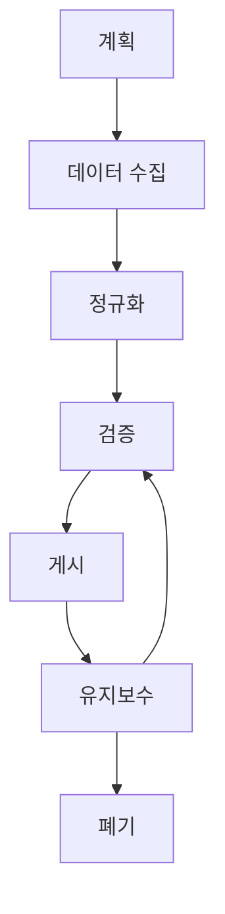

# Configuration Management Database (CMDB) 소개

## 📋 개요

CMDB(Configuration Management Database)는 네트워크 내 모든 하드웨어 및 소프트웨어 설치에 대한 정보를 볼 수 있는 중앙 위치입니다. 각 자산은 **Configuration Item (CI)**로 알려져 있습니다.

<p data-identifyelement="453" style="text-align: justify;"><span data-identifyelement="573" style="font-size: 14px; font-family: Helvetica, sans-serif;"><strong data-identifyelement="574"><a href="https://freshservice.com/cmdb">CMDB</a></strong> or <strong data-identifyelement="575">Configuration Management Database</strong> is a central location where you can view information about all the hardware and software installations in your network. Each asset is known as a <strong data-identifyelement="576">Configuration Item (CI)</strong>.</span></p><p data-identifyelement="453" style="text-align: justify;"><span data-identifyelement="577" style="font-size: 14px;"><span data-identifyelement="578" style="font-family: Helvetica,sans-serif;"><br data-identifyelement="579"></span></span></p><h3 data-identifyelement="456" dir="ltr" style="text-align: justify;"><span data-identifyelement="580" style="font-size: 16px;"><span data-identifyelement="581" style="font-family: Helvetica,sans-serif;"><strong data-identifyelement="582">Asset Management in Freshservice</strong></span></span></h3><p data-identifyelement="459" dir="ltr" style="text-align: justify;"><span data-identifyelement="583" style="font-size: 14px;"><span data-identifyelement="584" style="font-family: Helvetica,sans-serif;">Freshservice allows you to import all the <a href="https://freshservice.com/asset-management">assets</a> in your network using various methods. They are:&nbsp;</span></span></p><ul data-identifyelement="462"><li data-identifyelement="585" dir="ltr"><p data-identifyelement="586" dir="ltr" style="text-align: justify;"><span data-identifyelement="587" style="font-size: 14px;"><span data-identifyelement="588" style="font-family: Helvetica,sans-serif;">Discovery agent</span></span></p></li><li data-identifyelement="589" dir="ltr"><p data-identifyelement="590" dir="ltr" style="text-align: justify;"><span data-identifyelement="591" style="font-size: 14px;"><span data-identifyelement="592" style="font-family: Helvetica,sans-serif;">Discovery probe</span></span></p></li><li data-identifyelement="593" dir="ltr"><p data-identifyelement="594" dir="ltr" style="text-align: justify;"><span data-identifyelement="595" style="font-size: 14px;"><span data-identifyelement="596" style="font-family: Helvetica,sans-serif;">Import asset details</span></span></p></li><li data-identifyelement="597" dir="ltr"><p data-identifyelement="598" dir="ltr" style="text-align: justify;"><span data-identifyelement="599" style="font-size: 14px;"><span data-identifyelement="600" style="font-family: Helvetica,sans-serif;">Barcode scanning using mobile app</span></span></p></li></ul><p data-identifyelement="470" dir="ltr" style="text-align: justify;"><br data-identifyelement="601"></p><h3 data-identifyelement="473" dir="ltr" style="text-align: justify; margin-left: 20px;"><span data-identifyelement="602" style="font-size: 14px;"><span data-identifyelement="603" style="font-family: Helvetica,sans-serif;"><strong data-identifyelement="604">Discovery Agent</strong></span></span></h3><p data-identifyelement="476" dir="ltr" style="text-align: justify; margin-left: 20px;"><span data-identifyelement="605" style="font-size: 14px;"><span data-identifyelement="606" style="font-family: Helvetica,sans-serif;">Discovery Agent is a lightweight application which you'll have to install on to your Windows, Mac or Linux computers to continuously update information about the assets in real-time. The agent updates Freshservice with the hardware and software information of the computers in real-time.</span></span></p><p data-identifyelement="477" style="text-align: justify; margin-left: 20px;"><span data-identifyelement="607" style="font-size: 14px;"><span data-identifyelement="608" style="font-family: Helvetica,sans-serif;"><br data-identifyelement="609"></span></span></p><p data-identifyelement="479" dir="ltr" style="text-align: justify; margin-left: 20px;"><span data-identifyelement="610" style="font-size: 14px;"><span data-identifyelement="611" style="font-family: Helvetica,sans-serif;">To know more about the Discovery agent, click <a data-identifyelement="612" href="https://support.freshservice.com/support/solutions/articles/200393-freshservice-discovery-agent">here</a>.&nbsp;</span></span></p><p data-identifyelement="481" style="text-align: justify; margin-left: 20px;"><span data-identifyelement="613" style="font-size: 14px;"><span data-identifyelement="614" style="font-family: Helvetica,sans-serif;"><br data-identifyelement="615"></span></span></p><h3 data-identifyelement="483" dir="ltr" style="text-align: justify; margin-left: 20px;"><span data-identifyelement="616" style="font-size: 14px;"><span data-identifyelement="617" style="font-family: Helvetica,sans-serif;"><strong data-identifyelement="618">Discovery Probe</strong></span></span></h3><p data-identifyelement="486" dir="ltr" style="text-align: justify; margin-left: 20px;"><span data-identifyelement="619" style="font-size: 14px;"><span data-identifyelement="620" style="font-family: Helvetica,sans-serif;">The Freshservice Discovery Probe is a Windows application that is normally set up in a server in your organization. The Probe automatically scans and identifies any assets in your network through a domain or IP Range scan. Once the assets are identified the first time, these assets are then updated periodically based on the schedule that you can control.&nbsp;</span></span></p><p data-identifyelement="487" style="text-align: justify; margin-left: 20px;"><span data-identifyelement="621" style="font-size: 14px;"><span data-identifyelement="622" style="font-family: Helvetica,sans-serif;"><br data-identifyelement="623"></span></span></p><p data-identifyelement="489" dir="ltr" style="text-align: justify; margin-left: 20px;"><span data-identifyelement="624" style="font-size: 14px;"><span data-identifyelement="625" style="font-family: Helvetica,sans-serif;">To know more about the Discovery probe, click <a data-identifyelement="626" href="https://support.freshservice.com/support/solutions/articles/158679-freshservice-discovery-probe">here</a>.&nbsp;</span></span></p><p data-identifyelement="491" style="text-align: justify; margin-left: 20px;"><span data-identifyelement="627" style="font-size: 14px;"><span data-identifyelement="628" style="font-family: Helvetica,sans-serif;"><br data-identifyelement="629"></span></span></p><h3 data-identifyelement="493" dir="ltr" style="text-align: justify; margin-left: 20px;"><span data-identifyelement="630" style="font-size: 14px;"><span data-identifyelement="631" style="font-family: Helvetica,sans-serif;"><strong data-identifyelement="632">Import Asset Details</strong></span></span></h3><p data-identifyelement="496" dir="ltr" style="text-align: justify; margin-left: 20px;"><span data-identifyelement="633" style="font-size: 14px;"><span data-identifyelement="634" style="font-family: Helvetica,sans-serif;">You can import asset details in the form of a .csv file. To import asset details from a .csv file, kindly follow the steps mentioned below:&nbsp;</span></span></p><ol data-identifyelement="515"><li data-identifyelement="635"><p data-identifyelement="636" dir="ltr" style="text-align: justify;"><span data-identifyelement="637" style="font-size: 14px;"><span data-identifyelement="638" style="font-family: Helvetica,sans-serif;"><span data-identifyelement="639" style="font-size: 14px;"><span data-identifyelement="640" style="font-family: Helvetica,sans-serif;">Click on the <strong data-identifyelement="641">CMDB</strong> module on the left sidebar and choose <strong data-identifyelement="642">Assets.</strong></span></span><br data-identifyelement="643"></span></span></p></li><li data-identifyelement="644" dir="ltr"><p data-identifyelement="645" dir="ltr" style="text-align: justify;"><span data-identifyelement="646" style="font-size: 14px;"><span data-identifyelement="647" style="font-family: Helvetica,sans-serif;">Click on <strong data-identifyelement="648">Import</strong></span></span></p></li><li data-identifyelement="649" dir="ltr"><p data-identifyelement="650" dir="ltr" style="text-align: justify;"><span data-identifyelement="651" style="font-size: 14px;"><span data-identifyelement="652" style="font-family: Helvetica,sans-serif;">Select the CI type you wish to import.&nbsp;</span></span></p></li><li data-identifyelement="653" dir="ltr"><p data-identifyelement="654" dir="ltr" style="text-align: justify;"><span data-identifyelement="655" style="font-size: 14px;"><span data-identifyelement="656" style="font-family: Helvetica,sans-serif;">Choose the <strong data-identifyelement="657">CSV</strong> file from your computer and upload it onto Freshservice.&nbsp;</span></span></p></li><li data-identifyelement="658" dir="ltr"><p data-identifyelement="659" dir="ltr" style="text-align: justify;"><span data-identifyelement="660" style="font-size: 14px;"><span data-identifyelement="661" style="font-family: Helvetica,sans-serif;">Once done, click on <strong data-identifyelement="662">Import</strong>.&nbsp;</span></span></p></li></ol><p data-identifyelement="517" style="text-align: justify; margin-left: 20px;"><span data-identifyelement="663" style="font-size: 14px;"><span data-identifyelement="664" style="font-family: Helvetica,sans-serif;"><br data-identifyelement="665"></span></span></p><h3 data-identifyelement="519" dir="ltr" style="text-align: justify; margin-left: 20px;"><span data-identifyelement="666" style="font-size: 14px;"><span data-identifyelement="667" style="font-family: Helvetica,sans-serif;"><strong data-identifyelement="668">Barcode Scanning using Mobile App</strong></span></span></h3><p data-identifyelement="522" dir="ltr" style="text-align: justify; margin-left: 20px;"><span data-identifyelement="669" style="font-size: 14px;"><span data-identifyelement="670" style="font-family: Helvetica,sans-serif;">If you're using the Freshservice mobile app, you can use your smartphone's camera to scan the barcode of your assets. Once scanned, the asset information is automatically fetched into your Freshservice account.&nbsp;</span></span></p><p data-identifyelement="523" style="text-align: justify; margin-left: 20px;"><span data-identifyelement="671" style="font-size: 14px;"><span data-identifyelement="672" style="font-family: Helvetica,sans-serif;"><br data-identifyelement="673"></span></span></p><h3 data-identifyelement="525" dir="ltr" style="text-align: justify;"><span data-identifyelement="674" style="font-size: 14px;"><span data-identifyelement="675" style="font-family: Helvetica,sans-serif;"><strong data-identifyelement="676">Viewing an Asset</strong></span></span></h3><p data-identifyelement="528" dir="ltr" style="text-align: justify;"><span data-identifyelement="677" style="font-size: 14px;"><span data-identifyelement="678" style="font-family: Helvetica,sans-serif;">After scanning or importing the assets, they will be populated in the form of a list.&nbsp;</span></span></p><p data-identifyelement="529" style="text-align: justify;"><span data-identifyelement="679" style="font-size: 14px;"><span data-identifyelement="680" style="font-family: Helvetica,sans-serif;"><br data-identifyelement="681"></span></span></p><p data-identifyelement="531" dir="ltr" style="text-align: justify;"><span data-identifyelement="682" style="font-size: 14px;"><span data-identifyelement="683" style="font-family: Helvetica,sans-serif;"></span></span></p><p data-identifyelement="533" style="text-align: justify;"><span data-identifyelement="685" style="font-size: 14px;"><span data-identifyelement="686" style="font-family: Helvetica,sans-serif;"><br data-identifyelement="687"></span></span></p><p data-identifyelement="535" dir="ltr" style="text-align: justify;"><span data-identifyelement="688" style="font-size: 14px;"><span data-identifyelement="689" style="font-family: Helvetica,sans-serif;">When you click on an asset, you will be able to see the following information:&nbsp;</span></span></p><ul data-identifyelement="538"><li data-identifyelement="690" dir="ltr"><p data-identifyelement="691" dir="ltr" style="text-align: justify;"><span data-identifyelement="692" style="font-size: 14px;"><span data-identifyelement="693" style="font-family: Helvetica,sans-serif;"><strong data-identifyelement="694">Overview</strong> - You will have generic details about the asset followed by acquisition date, warranty information, serial number, OS type, OS version, and a unique identification number. It <span data-identifyelement="695" style="font-size: 14px;"><span data-identifyelement="696" style="font-family: Helvetica,sans-serif;">shows you the list of expenses that are associated with the asset. This includes maintenance cost, support cost, disposal cost, etc. The <span data-identifyelement="697" style="font-size: 14px;"><span data-identifyelement="698" style="font-family: Helvetica,sans-serif;">list of components that make up the asset will also be displayed. For example, if you're viewing a laptop, this section will provide details about the processor, chipset, storage capacity, RAM, etc.&nbsp;</span></span></span></span></span></span></p></li><li data-identifyelement="699" dir="ltr"><p data-identifyelement="700" dir="ltr" style="text-align: justify;"><span data-identifyelement="701" style="font-size: 14px;"><span data-identifyelement="702" style="font-family: Helvetica,sans-serif;"><strong data-identifyelement="703">Relationship</strong> - Here you can see the relationship of your asset with other assets in the network. If you're an admin, you can create a relationship for every asset in your network.&nbsp;</span></span></p></li><li data-identifyelement="704" dir="ltr"><p data-identifyelement="705" dir="ltr" style="text-align: justify;"><span data-identifyelement="706" style="font-size: 14px;"><span data-identifyelement="707" style="font-family: Helvetica,sans-serif;"><strong data-identifyelement="708">Requests</strong> - You can get a glimpse of all the <a href="https://freshservice.com/service-request-software/service-request-software-best-practices">service requests</a> associated with the particular asset/CI.&nbsp;</span></span></p></li><li data-identifyelement="709" dir="ltr"><p data-identifyelement="710" dir="ltr" style="text-align: justify;"><span data-identifyelement="711" style="font-size: 14px;"><span data-identifyelement="712" style="font-family: Helvetica,sans-serif;"><strong data-identifyelement="713">Contracts</strong> - You can view the list of active contracts associated with the asset.&nbsp;</span></span></p></li><li data-identifyelement="714" dir="ltr"><p data-identifyelement="715" dir="ltr" style="text-align: justify;"><span data-identifyelement="716" style="font-size: 14px;"><span data-identifyelement="717" style="font-family: Helvetica,sans-serif;"><strong data-identifyelement="718">Activity</strong> - You can view the activity related to a particular asset. This includes information such as when the asset was requested, who was it assigned to, the requests it had raised in the past, etc.&nbsp;</span></span></p></li></ul><p data-identifyelement="562" dir="ltr" style="text-align: justify;"><span data-identifyelement="719" style="font-size: 14px;"><span data-identifyelement="720" style="font-family: Helvetica,sans-serif;"></span></span></p><p data-identifyelement="564" style="text-align: justify;"><span data-identifyelement="722" style="font-size: 14px;"><span data-identifyelement="723" style="font-family: Helvetica,sans-serif;"><br data-identifyelement="724"></span></span></p><h3 data-identifyelement="566" dir="ltr" style="text-align: justify;"><span data-identifyelement="725" style="font-size: 14px;"><span data-identifyelement="726" style="font-family: Helvetica,sans-serif;"><strong data-identifyelement="727">Edit Asset Properties</strong></span></span></h3><p data-identifyelement="569" dir="ltr" style="text-align: justify;"><span data-identifyelement="728" style="font-size: 14px;"><span data-identifyelement="729" style="font-family: Helvetica,sans-serif;">While viewing an asset, you can also make changes to its properties such as the state of the <em data-identifyelement="730">asset, impact, usage type, location</em>, etc.&nbsp;</span></span></p><p data-identifyelement="575" dir="ltr" style="text-align: justify;"><span data-identifyelement="731" style="font-size: 14px;"><span data-identifyelement="732" style="font-family: Helvetica,sans-serif;"></span></span></p><p data-identifyelement="577" style="text-align: justify;"><span data-identifyelement="734" style="font-size: 14px;"><span data-identifyelement="735" style="font-family: Helvetica,sans-serif;"><br data-identifyelement="736"></span></span></p><h3 data-identifyelement="579" dir="ltr" style="text-align: justify;"><span data-identifyelement="737" style="font-size: 16px;"><span data-identifyelement="738" style="font-family: Helvetica, sans-serif;"><strong data-identifyelement="739">Contract Management in Freshservice</strong></span></span></h3><p data-identifyelement="582" dir="ltr" style="text-align: justify;"><span data-identifyelement="740" style="font-size: 14px;"><span data-identifyelement="741" style="font-family: Helvetica,sans-serif;">Contracts module in Freshservice lets you manage contracts established with third-party vendors. Freshservice supports different types of contracts – from creating your very own custom contract types to supporting lease, maintenance, as well as software license contracts, by default.</span></span></p><p data-identifyelement="582" dir="ltr" style="text-align: justify;"><span data-identifyelement="742" style="font-size: 14px;"><span data-identifyelement="743" style="font-family: Helvetica,sans-serif;"><br data-identifyelement="744"><strong data-identifyelement="745">Note</strong>: Only users who have drafted the contract will be able to submit the contract for approval.</span></span></p><p data-identifyelement="588" dir="ltr" style="text-align: justify;"><span data-identifyelement="749" style="font-size: 14px;"><span data-identifyelement="750" style="font-family: Helvetica,sans-serif;"></span></span><br></p><p data-identifyelement="590" style="text-align: justify;"><span data-identifyelement="752" style="font-size: 14px;"><span data-identifyelement="753" style="font-family: Helvetica,sans-serif;"><br data-identifyelement="754"></span></span></p><p data-identifyelement="592" dir="ltr" style="text-align: justify;"><span data-identifyelement="755" style="font-size: 14px;"><span data-identifyelement="756" style="font-family: Helvetica,sans-serif;">Vendor details can be added or edited from <strong data-identifyelement="757">Settings &gt; Configuration Management &gt; Vendors.&nbsp;</strong></span></span></p><p><a href="https://freshservice.com/asset-management">Asset Management</a></p><p><a href="https://freshservice.com/asset-management">Asset Management</a></p>

## 🎯 한국 기업 활용 시나리오

### 시나리오 1: 대기업 IT 인프라 관리
**회사**: 삼성전자 IT인프라팀
- **전사 자산 통합**: 전국 사업장의 모든 IT 자산을 CMDB에 통합 관리
- **자동 검색**: Discovery Agent를 통해 모든 PC, 서버, 네트워크 장비 자동 등록
- **의존성 관리**: 시스템 간 의존성을 매핑하여 장애 영향도 분석
- **규정 준수**: 소프트웨어 라이선스 및 하드웨어 자산 현황 실시간 추적

### 시나리오 2: 금융권 보안 컴플라이언스
**회사**: 하나은행 IT보안팀
- **보안 자산 관리**: 방화벽, IPS, 암호화 장비 등 보안 장비 전문 관리
- **패치 관리**: OS 및 보안 소프트웨어 패치 현황 추적
- **접근 제어**: 민감 시스템의 접근 권한 및 연결 관계 관리
- **감사 대응**: 금감원 검사 시 IT 자산 현황 즉시 제공

### 시나리오 3: 제조업 생산 설비 관리
**회사**: LG디스플레이 생산기술팀
- **설비 자산 관리**: 생산라인 장비, 제어 시스템, 센서 등 통합 관리
- **예방 정비**: 장비별 유지보수 계약 및 보증 기간 관리
- **생산 연계**: 제조실행시스템(MES)과 연동하여 설비 상태 실시간 반영
- **비용 최적화**: 설비별 TCO 분석을 통한 교체 시기 최적화

## 💡 CMDB 구축 모범사례

### 데이터 수집 전략
```markdown
📊 자동 데이터 수집:
✅ Discovery Agent - 개별 PC/서버에 설치
✅ Discovery Probe - 네트워크 스캔 기반
✅ API 연동 - 기존 시스템과 자동 동기화
✅ 에이전트리스 검색 - SNMP, WMI 활용

📋 수동 데이터 입력:
✅ CSV 대량 import - 기존 자산 대장 활용
✅ 모바일 앱 - 바코드 스캔으로 현장 등록
✅ 웹 폼 - 신규 자산 상세 정보 입력
```

### CI 유형별 관리 전략

#### 🖥️ 하드웨어 CI
```markdown
필수 속성:
- 제조사, 모델명, 시리얼 번호
- 구매일, 보증 기간, 위치
- 사용자, 담당부서
- 상태 (운영중, 예약, 폐기 등)

관계 설정:
- 사용자 ↔ 컴퓨터 (Uses)
- 컴퓨터 ↔ 소프트웨어 (Runs)
- 서버 ↔ 서비스 (Hosts)
```

#### 💿 소프트웨어 CI
```markdown
필수 속성:
- 제품명, 버전, 라이선스 유형
- 설치 날짜, 라이선스 만료일
- 라이선스 수량, 사용 중인 수량

관계 설정:
- 소프트웨어 ↔ 컴퓨터 (Installed on)
- 라이선스 ↔ 사용자 (Assigned to)
- 애플리케이션 ↔ 데이터베이스 (Depends on)
```

#### 🌐 서비스 CI
```markdown
필수 속성:
- 서비스명, 설명, 비즈니스 중요도
- 서비스 레벨, 가용시간
- 서비스 오너, 기술 담당자

관계 설정:
- 서비스 ↔ 애플리케이션 (Depends on)
- 서비스 ↔ 인프라 (Runs on)
- 서비스 ↔ 사용자 (Used by)
```

## ⚠️ CMDB 관리 주의사항

:::warning 데이터 품질 관리
- **정확성**: 자동 검색과 수동 검증을 병행하여 데이터 정확도 확보
- **완전성**: 모든 CI가 누락 없이 등록되었는지 정기적 확인
- **일관성**: 명명 규칙과 분류 기준을 일관되게 적용
- **실시간성**: 변경사항이 즉시 반영되도록 프로세스 구축
:::

### 데이터 품질 개선 방법
```markdown
자동화 도구 활용:
✅ 중복 CI 자동 탐지 및 병합
✅ 데이터 유효성 검사 규칙 설정
✅ 정기적 데이터 정합성 체크
✅ 사용하지 않는 CI 자동 식별

프로세스 개선:
✅ CI 등록/변경 승인 프로세스
✅ 정기적 데이터 검토 회의
✅ 담당자별 데이터 관리 책임 할당
✅ 사용자 교육 및 가이드라인 제공
```

## 📊 CMDB 성과 지표

| KPI | 목표 수치 | 측정 방법 |
|-----|-----------|-----------|
| **데이터 정확도** | > 95% | 샘플 검증을 통한 정확도 측정 |
| **CI 커버리지** | > 90% | 실제 자산 대비 CMDB 등록율 |
| **관계 정의율** | > 80% | CI 간 관계가 정의된 비율 |
| **데이터 최신성** | < 7일 | 마지막 업데이트 이후 경과일 |

## 🔄 CMDB 생명주기 관리



## 🔗 관련 문서

- [Asset Management](../admin-settings/asset-management)
- [Incident Management](../incident-management/)
- [Change Management](../change-management/)
- [Problem Management](../problem-management/)