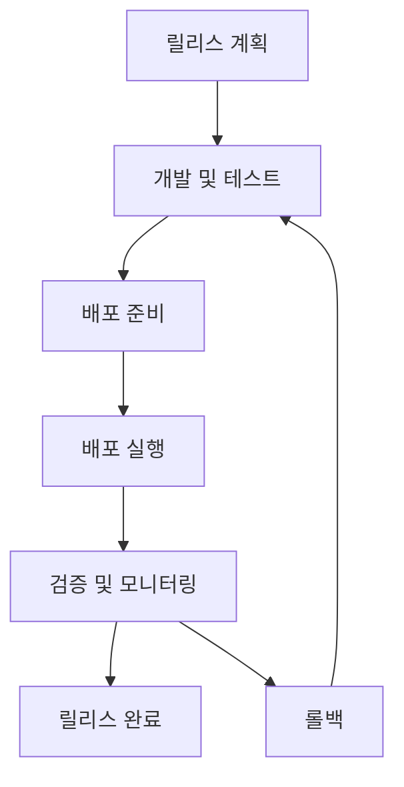

# 릴리스 관리

## 📋 개요

변경이 CAB(Change Advisory Board)에 의해 승인되면, 변경의 배포를 계획하는 프로세스가 시작됩니다. 변경이 롤아웃되기 전에 기술적 및 비기술적 모든 측면이 고려되는 것이 중요합니다.

## 💡 릴리스 관리 모범사례

### 릴리스 계획 수립
```markdown
📋 릴리스 계획 필수 요소:
✅ 릴리스 목표 및 범위 정의
✅ 배포 일정 및 마일스톤 설정
✅ 리소스 할당 계획
✅ 테스트 시나리오 작성
✅ 의사소통 계획 수립
✅ 리스크 분석 및 대응 방안
```

### 배포 유형별 전략

#### 🔵 Big Bang Release
```markdown
특징: 모든 변경사항을 한 번에 배포
적용: 시스템 전체 교체, 인프라 업그레이드
장점: 단순한 프로세스, 빠른 완료
단점: 높은 리스크, 복구 어려움
```

#### 🟢 Phased Release
```markdown
특징: 단계별로 점진적 배포
적용: 사용자 그룹별, 지역별 배포
장점: 리스크 분산, 피드백 반영 가능
단점: 복잡한 관리, 긴 배포 기간
```

#### 🟡 Rolling Release
```markdown
특징: 연속적인 작은 단위 배포
적용: 클라우드 환경, 마이크로서비스
장점: 서비스 중단 없음, 빠른 문제 해결
단점: 복잡한 버전 관리
```

### 빌드 및 테스트 계획
```markdown
Build Plan 포함사항:
- 소스 코드 빌드 절차
- 의존성 관리 방법
- 환경별 설정 파일
- 패키지 생성 스크립트

Test Plan 포함사항:
- 단위 테스트 시나리오
- 통합 테스트 케이스
- 성능 테스트 계획
- 사용자 수락 테스트
```

## ⚠️ 위험 관리

:::warning 주요 위험 요소
- **서비스 중단**: 배포 중 예상치 못한 서비스 장애
- **데이터 무결성**: 데이터 마이그레이션 과정에서 발생할 수 있는 문제
- **성능 저하**: 새 버전의 성능 이슈
- **호환성 문제**: 기존 시스템과의 호환성 충돌
:::

### 리스크 완화 전략
```markdown
사전 대비:
✅ 충분한 테스트 환경 구축
✅ 상세한 롤백 계획 수립
✅ 모니터링 도구 구성
✅ 팀 간 명확한 역할 분담

배포 중:
✅ 실시간 모니터링
✅ 단계별 검증 수행
✅ 즉시 대응 가능한 체계
✅ 지속적인 의사소통

배포 후:
✅ 성능 지표 추적
✅ 사용자 피드백 수집
✅ 사후 검토 회의
✅ 교훈 사항 문서화
```

## 📊 릴리스 성과 지표

| KPI | 목표 수치 | 측정 방법 |
|-----|-----------|-----------|
| **릴리스 성공률** | > 95% | 성공한 릴리스 / 전체 릴리스 |
| **배포 시간** | < 계획 대비 10% | 실제 소요시간 / 계획 시간 |
| **롤백률** | < 5% | 롤백한 릴리스 / 전체 릴리스 |
| **다운타임** | < 4시간/월 | 릴리스로 인한 서비스 중단 시간 |

## 🔄 릴리스 생명주기



## 🔗 관련 문서