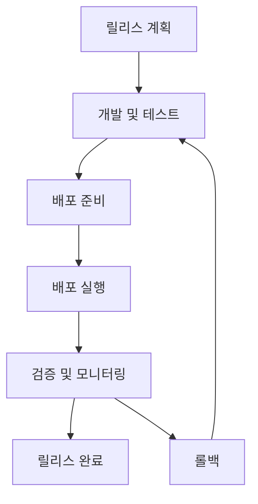

# 릴리스 관리

## 📋 개요

변경이 CAB(Change Advisory Board)에 의해 승인되면, 변경의 배포를 계획하는 프로세스가 시작됩니다. 변경이 롤아웃되기 전에 기술적 및 비기술적 모든 측면이 고려되는 것이 중요합니다.

<h1 data-identifyelement="486">Release Management</h1><p data-identifyelement="487"><br data-identifyelement="488"></p><p data-identifyelement="489">Once a Change is approved by the CAB, the process of planning the deployment of the change begins. It is important to make sure that all the aspects of the Change, technical and nontechnical, are considered before it is rolled out.&nbsp;</p><p data-identifyelement="490"><br data-identifyelement="491"></p><h3 data-identifyelement="492" dir="ltr">Release Management in Freshservice</h3><p data-identifyelement="493"><br data-identifyelement="494"></p><p data-identifyelement="495" dir="ltr">The Releases tab in Freshservice also provides custom filter options to help you view Releases<br data-identifyelement="496">that match specific conditions.</p><p data-identifyelement="497" dir="ltr">&nbsp; &nbsp; &nbsp; &nbsp; ● New and Your Open Releases<br data-identifyelement="498">&nbsp; &nbsp; &nbsp; &nbsp; ● Your Completed Releases<br data-identifyelement="499">&nbsp; &nbsp; &nbsp; &nbsp; ● Your Releases<br data-identifyelement="500">&nbsp; &nbsp; &nbsp; &nbsp; ● Unassigned Releases<br data-identifyelement="501">&nbsp; &nbsp; &nbsp; &nbsp; ● Completed Releases<br data-identifyelement="502">&nbsp; &nbsp; &nbsp; &nbsp; ● Incomplete Releases<br data-identifyelement="503">&nbsp; &nbsp; &nbsp; &nbsp; ● Emergency Releases<br data-identifyelement="504">&nbsp; &nbsp; &nbsp; &nbsp; ● Trash<br data-identifyelement="505">&nbsp; &nbsp; &nbsp; &nbsp; ● All Releases</p><p data-identifyelement="506" dir="ltr">Releases can also be sorted by the date created, last modified, priority, status and in ascending or descending order.</p><p data-identifyelement="507"></p><p data-identifyelement="509" dir="ltr"></p><h3 data-identifyelement="511" dir="ltr"><br data-identifyelement="512"></h3><h3 data-identifyelement="513" dir="ltr">Bulk Actions</h3><p data-identifyelement="514"><br data-identifyelement="515"></p><p data-identifyelement="516" dir="ltr">You can select multiple Releases and perform these bulk actions:</p><ul data-identifyelement="517"><li data-identifyelement="518" dir="ltr"><p data-identifyelement="519" dir="ltr"><strong data-identifyelement="520">Delete</strong> - Select the Release(s) you don't need anymore and click Delete.</p></li><li data-identifyelement="521" dir="ltr"><p data-identifyelement="522" dir="ltr"><strong data-identifyelement="523">Pick Up</strong> - This option assigns the Release to you.</p></li><li data-identifyelement="524" dir="ltr"><p data-identifyelement="525" dir="ltr"><strong data-identifyelement="526">Assign to Agent</strong> - In case you need to assign a Release to another agent, click on this option and then select the agent's name from the drop down-menu.</p></li></ul><p data-identifyelement="527"><br data-identifyelement="528"></p><h3 data-identifyelement="529" dir="ltr">Modification options available in Release view page</h3><p data-identifyelement="530"><br data-identifyelement="531"></p><p data-identifyelement="532" dir="ltr">To access more details regarding a Release or to modify its properties, from the <strong data-identifyelement="533">Releases</strong> tab, click on the Release. Here's the list of options you get there:</p><p data-identifyelement="534" dir="ltr"><strong data-identifyelement="535">Update</strong> - On the view page, you can update Releases by adding details like:</p><p data-identifyelement="537" dir="ltr">&nbsp; &nbsp; &nbsp; &nbsp; ● Build Plan<br data-identifyelement="538">&nbsp; &nbsp; &nbsp; &nbsp; ● Test Plan</p><p data-identifyelement="539" dir="ltr">In case they're already added, you get options to edit them.</p><p data-identifyelement="541" dir="ltr"><strong data-identifyelement="542">More</strong> - You can change properties like Planned Start & End Dates, Status, Priority, Release, Type, Group and Agent right from the Change view page.</p><p data-identifyelement="543" dir="ltr">If you'd like to change the Subject line or Description, click on <strong data-identifyelement="544">More</strong> and click <strong data-identifyelement="545">Edit</strong>. You can also attach a CI to the problem if need be.</p><p data-identifyelement="547" dir="ltr">To Delete the Release or Mark it as completed, click on More and then click the respective option.</p><p data-identifyelement="550" dir="ltr"><br data-identifyelement="552"></p><p data-identifyelement="553" dir="ltr">3. Freshservice lets you track the elapsed time for Releases. Scroll all the way down and click on <strong data-identifyelement="554">Time tracked → Add time</strong>, and click on <strong data-identifyelement="555">Start timer</strong> to start the auto-timer. You can also specify the amount of time elapsed since the Release was created to start the timer at that point.</p><p data-identifyelement="556" dir="ltr">4. You can find options to add notes and tasks, link Changes and CIs and view all activities performed on the Change, right below the description on the Change view page</p><p data-identifyelement="557"><br data-identifyelement="558"></p><p><a href="https://freshservice.com/itsm/release-management">Release Management</a></p>

## 🎯 한국 기업 활용 시나리오

### 시나리오 1: 대형 ERP 시스템 업그레이드
**회사**: 롯데그룹 IT본부
- **Major Release**: 연 2회 대규모 ERP 업그레이드
- **단계적 배포**: 본사 → 주요 계열사 → 전체 적용 순서
- **배포 윈도우**: 주말 야간 시간대 활용으로 업무 영향 최소화
- **롤백 계획**: 문제 발생 시 4시간 내 원복 가능한 절차

### 시나리오 2: 모바일 앱 정기 업데이트
**회사**: 배달의민족 개발팀
- **Agile Release**: 2주마다 앱 업데이트 배포
- **A/B 테스트**: 신기능을 일부 사용자에게 먼저 적용
- **모니터링**: 배포 후 실시간 오류율 및 성능 지표 추적
- **Hot Fix**: 긴급 수정 시 1시간 내 배포 완료

### 시나리오 3: 금융 시스템 보안 패치
**회사**: KB국민은행 정보보호팀
- **Emergency Release**: 보안 취약점 발견 시 긴급 패치
- **영향도 분석**: 핵심 뱅킹 서비스에 미치는 영향 사전 검토
- **규정 준수**: 금감원 보고 및 승인 절차 포함
- **검증 테스트**: 모든 거래 기능 정상 작동 확인

## 💡 릴리스 관리 모범사례

### 릴리스 계획 수립
```markdown
📋 릴리스 계획 필수 요소:
✅ 릴리스 목표 및 범위 정의
✅ 배포 일정 및 마일스톤 설정
✅ 리소스 할당 계획
✅ 테스트 시나리오 작성
✅ 의사소통 계획 수립
✅ 리스크 분석 및 대응 방안
```

### 배포 유형별 전략

#### 🔵 Big Bang Release
```markdown
특징: 모든 변경사항을 한 번에 배포
적용: 시스템 전체 교체, 인프라 업그레이드
장점: 단순한 프로세스, 빠른 완료
단점: 높은 리스크, 복구 어려움
```

#### 🟢 Phased Release
```markdown
특징: 단계별로 점진적 배포
적용: 사용자 그룹별, 지역별 배포
장점: 리스크 분산, 피드백 반영 가능
단점: 복잡한 관리, 긴 배포 기간
```

#### 🟡 Rolling Release
```markdown
특징: 연속적인 작은 단위 배포
적용: 클라우드 환경, 마이크로서비스
장점: 서비스 중단 없음, 빠른 문제 해결
단점: 복잡한 버전 관리
```

### 빌드 및 테스트 계획
```markdown
Build Plan 포함사항:
- 소스 코드 빌드 절차
- 의존성 관리 방법
- 환경별 설정 파일
- 패키지 생성 스크립트

Test Plan 포함사항:
- 단위 테스트 시나리오
- 통합 테스트 케이스
- 성능 테스트 계획
- 사용자 수락 테스트
```

## ⚠️ 위험 관리

:::warning 주요 위험 요소
- **서비스 중단**: 배포 중 예상치 못한 서비스 장애
- **데이터 무결성**: 데이터 마이그레이션 과정에서 발생할 수 있는 문제
- **성능 저하**: 새 버전의 성능 이슈
- **호환성 문제**: 기존 시스템과의 호환성 충돌
:::

### 리스크 완화 전략
```markdown
사전 대비:
✅ 충분한 테스트 환경 구축
✅ 상세한 롤백 계획 수립
✅ 모니터링 도구 구성
✅ 팀 간 명확한 역할 분담

배포 중:
✅ 실시간 모니터링
✅ 단계별 검증 수행
✅ 즉시 대응 가능한 체계
✅ 지속적인 의사소통

배포 후:
✅ 성능 지표 추적
✅ 사용자 피드백 수집
✅ 사후 검토 회의
✅ 교훈 사항 문서화
```

## 📊 릴리스 성과 지표

| KPI | 목표 수치 | 측정 방법 |
|-----|-----------|-----------|
| **릴리스 성공률** | > 95% | 성공한 릴리스 / 전체 릴리스 |
| **배포 시간** | < 계획 대비 10% | 실제 소요시간 / 계획 시간 |
| **롤백률** | < 5% | 롤백한 릴리스 / 전체 릴리스 |
| **다운타임** | < 4시간/월 | 릴리스로 인한 서비스 중단 시간 |

## 🔄 릴리스 생명주기



## 🔗 관련 문서

- [Change Management](../change-management/)
- [Problem Management](../problem-management/)
- [Incident Management](../incident-management/)
- [Service Desk Productivity](../admin-settings/service-desk-productivity)