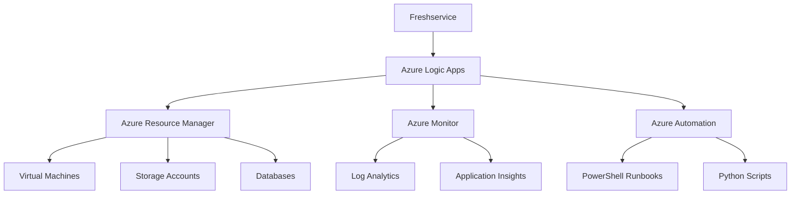

# Microsoft Azure 오케스트레이션

## 📋 개요

Freshservice와 Microsoft Azure 통합을 통해 클라우드 인프라 관리를 자동화하고, Azure 리소스와 관련된 IT 서비스 요청을 효율적으로 처리할 수 있습니다. Infrastructure as Code (IaC) 방식으로 클라우드 자원을 관리할 수 있습니다.

<p>Microsoft Azure Orchestration</p>

## 🚀 Azure 통합 아키텍처

### 연동 구성도


### 주요 통합 서비스
```markdown
🔧 Azure Automation:
✅ PowerShell/Python 런북 실행
✅ 정기적 작업 스케줄링
✅ 상태 구성 관리 (DSC)
✅ 업데이트 관리 자동화

📊 Azure Monitor:
✅ 리소스 성능 모니터링
✅ 로그 수집 및 분석
✅ 알림 규칙 설정
✅ 대시보드 시각화

⚡ Azure Logic Apps:
✅ 워크플로 자동화
✅ 서비스 간 통합
✅ 이벤트 기반 트리거
✅ API 연동 및 데이터 변환

🔐 Azure Active Directory:
✅ 통합 인증 (SSO)
✅ 역할 기반 액세스 제어
✅ 조건부 액세스 정책
✅ ID 보호 및 감사
```

## 💡 자동화 시나리오

### VM 라이프사이클 관리
```markdown
요청 → 승인 → 프로비저닝 → 설정 → 인계

1️⃣ 요청 단계:
- Freshservice 서비스 카탈로그에서 VM 요청
- 사양, 용도, 기간 등 상세 정보 입력
- 비용 정보 자동 계산 및 표시

2️⃣ 승인 단계:
- 요청 금액별 승인 워크플로
- IT 관리자 및 비용센터 승인
- 보안 정책 준수 여부 자동 검증

3️⃣ 프로비저닝 단계:
- Azure Resource Manager 템플릿 실행
- 네트워킹 및 보안 그룹 자동 설정
- 모니터링 에이전트 자동 설치

4️⃣ 설정 단계:
- OS 패치 및 보안 업데이트
- 회사 표준 소프트웨어 설치
- 백업 정책 적용

5️⃣ 인계 단계:
- 접속 정보 안전한 전달
- 사용법 가이드 제공
- 정기 리뷰 일정 수립
```

### 보안 인시던트 자동 대응
```markdown
탐지 → 분석 → 격리 → 복구 → 보고

🚨 위협 탐지:
- Azure Security Center 알림
- Azure Sentinel SIEM 이벤트
- 사용자 신고 접수

🔍 자동 분석:
- 영향도 및 위험도 평가
- 관련 리소스 식별
- 유사 사례 검색

🚫 자동 격리:
- 의심스러운 리소스 격리
- 네트워크 액세스 차단
- 계정 임시 비활성화

🔧 복구 프로세스:
- 백업에서 데이터 복원
- 패치 및 보안 업데이트
- 시스템 정상화 확인

📋 사후 보고:
- 인시던트 상세 보고서
- 근본 원인 분석
- 재발 방지 조치 계획
```

### 비용 최적화 자동화
```markdown
모니터링 → 분석 → 권고 → 실행 → 보고

📊 비용 모니터링:
- 일일 비용 추이 분석
- 예산 대비 사용률 체크
- 비정상적 증가 패턴 탐지

🎯 최적화 권고:
- 유휴 리소스 식별
- 적절한 인스턴스 크기 제안
- 예약 인스턴스 활용 권고

⚡ 자동 실행:
- 사용하지 않는 VM 자동 중지
- 스케일링 규칙 적용
- 스토리지 계층 자동 변경

📈 보고 및 분석:
- 비용 절감 효과 측정
- 부서별 비용 할당
- 트렌드 분석 및 예측
```

## 🛠️ 구현 가이드

### Logic Apps 워크플로 예시
```json
{
  "definition": {
    "triggers": {
      "Freshservice_Webhook": {
        "type": "HttpRequest",
        "inputs": {
          "schema": {
            "type": "object",
            "properties": {
              "ticket_id": {"type": "string"},
              "service_request": {"type": "string"},
              "requester": {"type": "string"}
            }
          }
        }
      }
    },
    "actions": {
      "Parse_Request": {
        "type": "ParseJson",
        "inputs": {
          "content": "@triggerBody()",
          "schema": "@triggers()['inputs']['schema']"
        }
      },
      "Create_VM": {
        "type": "Http",
        "inputs": {
          "method": "PUT",
          "uri": "https://management.azure.com/subscriptions/{subscription}/resourceGroups/{rg}/providers/Microsoft.Compute/virtualMachines/{vm-name}",
          "headers": {
            "Authorization": "Bearer @{variables('access_token')}"
          },
          "body": "@variables('vm_template')"
        }
      }
    }
  }
}
```

### PowerShell 런북 예시
```powershell
param(
    [Parameter(Mandatory=$true)]
    [string]$TicketId,
    
    [Parameter(Mandatory=$true)]
    [string]$VMName,
    
    [Parameter(Mandatory=$true)]
    [string]$ResourceGroup
)

# Azure 연결
Connect-AzAccount -Identity

try {
    # VM 생성
    $vm = New-AzVM -ResourceGroupName $ResourceGroup -Name $VMName -Size "Standard_B2s"
    
    # 태그 적용
    Set-AzResource -ResourceId $vm.Id -Tag @{
        "TicketId" = $TicketId
        "Environment" = "Development"
        "Owner" = "IT-Team"
    } -Force
    
    # Freshservice 업데이트
    $result = @{
        "status" = "success"
        "vm_id" = $vm.VmId
        "ip_address" = $vm.PublicIpAddress
    }
    
    # 결과 반환
    Write-Output $result | ConvertTo-Json
}
catch {
    Write-Error "VM 생성 실패: $($_.Exception.Message)"
    
    # 실패 시 Freshservice 알림
    $error_result = @{
        "status" = "failed"
        "error" = $_.Exception.Message
    }
    
    Write-Output $error_result | ConvertTo-Json
}
```

## 📊 모니터링 및 거버넌스

### Azure Monitor 대시보드
```markdown
📈 실시간 지표:
- 활성 리소스 수
- CPU/메모리 사용률
- 네트워크 트래픽
- 스토리지 사용량

⚠️ 알림 규칙:
- 리소스 사용률 임계값 초과
- 비정상적 네트워크 활동
- 보안 정책 위반
- 예산 초과 경고

📊 사용량 분석:
- 부서별 리소스 사용 현황
- 시간대별 사용 패턴
- 비용 센터별 할당
- ROI 분석 리포트
```

### 거버넌스 정책
```markdown
🔒 Azure Policy 예시:

리소스 명명 규칙:
- 환경별 접두사 필수 (dev-, prod-)
- 부서 코드 포함 (it-, hr-, fin-)
- 순번 및 용도 명시

태그 정책:
- Owner (필수): 리소스 책임자
- Environment (필수): 환경 구분
- CostCenter (필수): 비용 센터
- Project (옵션): 프로젝트 코드

보안 정책:
- 공용 IP 사용 제한
- 암호화 설정 필수
- 네트워크 보안 그룹 기본 적용
- 백업 정책 자동 적용
```

## ⚠️ 보안 및 규정 준수

:::warning Azure 통합 보안 고려사항
- **서비스 주체**: 최소 권한 원칙으로 Azure 서비스 주체 설정
- **키 관리**: Azure Key Vault를 통한 안전한 인증 정보 관리
- **네트워크 보안**: 방화벽 및 NSG를 통한 트래픽 제어
- **감사 로그**: 모든 API 호출 및 리소스 변경 사항 기록
:::

### 규정 준수 체크리스트
```markdown
✅ 데이터 보호:
- 개인정보 암호화 저장
- 데이터 위치 제한 (한국 리전)
- 백업 데이터 보안
- 데이터 삭제 정책

✅ 접근 제어:
- 다단계 인증 (MFA) 적용
- 역할 기반 액세스 제어
- 정기적 권한 검토
- 특권 계정 관리

✅ 감사 및 로깅:
- 활동 로그 수집
- 보안 이벤트 모니터링
- 규정 준수 보고서
- 인시던트 대응 기록

✅ 업무 연속성:
- 재해복구 계획
- 백업 및 복원 테스트
- 서비스 가용성 모니터링
- 비상 연락체계
```

## 🔗 관련 문서